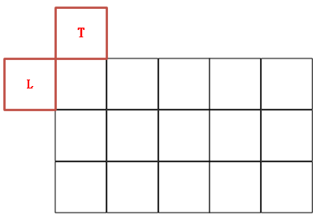
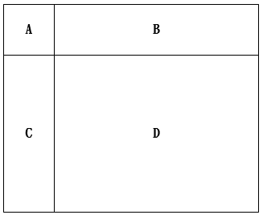
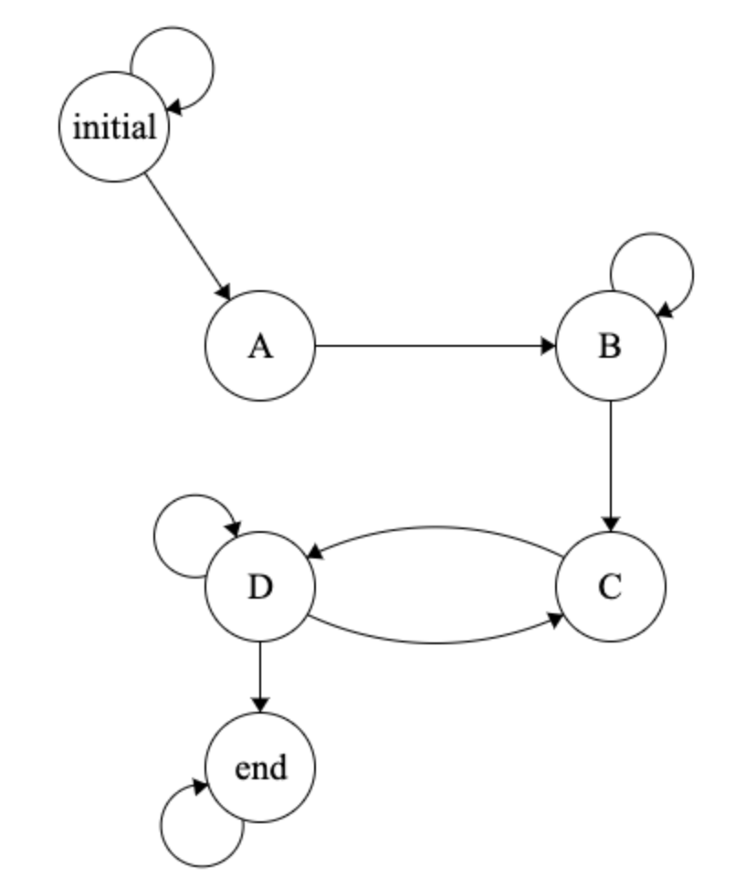

# 影像處理
此項主要目的，是作為影像處理的前置步驟，為後續實作卷積運算（Convolution）以及更進階的深度神經網路（Neural Network）架構奠定基礎。

使用一個簡單的濾波操作，其核心概念為：針對影像中的每個像素，將其「上方像素」以及「左方像素」的數值進行相加，並將總和除以 2，作為該位置新的像素值。

  

我們將該濾波過程劃分為 A、B、C、D 四種狀態：
* 狀態 A：初始化或輸入讀取階段，準備像素資料。
* 狀態 B：取得左方像素的數值。
* 狀態 C：取得上方像素的數值。
* 狀態 D：完成加總與平均（除以 2）的運算，並輸出新的像素值。

  

在此基礎上，將利用有限狀態機（Finite State Machine, FSM）來實現整體流程。

  

